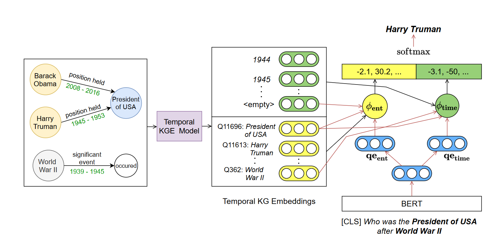

# 多粒度时序知识图谱问答挑战赛Baseline模型

挑战赛地址：https://www.datafountain.cn/competitions/634


全国大数据与计算智能挑战赛是由国防科技大学系统工程学院大数据与决策实验室组织的年度赛事活动，旨在深入挖掘大数据应用实践中亟需破解的能力生成难题，选拔汇聚数据领域优势团队，促进大数据领域的技术创新和面向需求的成果生成，推动形成“集智众筹、联合攻关、共享共用”的研建用一体迭代演进创新模式。

### 赛题背景
基于知识图谱的问答是用知识图谱中的事实来回答自然语言问题，通过借助信息检索、语义解析等方式在知识图谱寻找到最符合的答案，实现对问题的高效解答。常规的知识图谱问答使用静态知识图谱作为知识库回答自然语言问题，其中的知识与信息是一成不变的，而在实际生活中，知识往往是动态更新的，这也是知识的重要特征之一。面对这类动态知识，常规方法难以进行有效推理和解答，难以充分满足实际业务应用需求。

动态开放的组织环境需要更快的信息处理、更及时的信息更新、更广泛的信息创新，时间维度的信息变得越来越重要。本赛题面向动态环境下的多粒度时序知识问答场景，针对现有技术存在的不足，设置多粒度时序知识图谱问答任务，重点考察参赛系统在多粒度时间和多时序约束条件下的问答推理能力。

### 赛题任务
以四元组的形式给定一个时序知识图谱，其格式如下：
[头实体 关系 尾实体 时间]
对于给定的每一个问题，参赛者需要依据时序知识图谱中的信息进行回答，问题中涉及多种粒度的时间信息，以及多种类型的时间约束条件。示例：


|示例查询|	答案|
|  ----  | ----  |
|Who condemned Abhisit Vejjajiva in May 2010?	|Thailand
|Who was the first to visit the Middle East in 2008?	|Frank Bainimarama|
|When did the Aam Aadmi Party first negotiated with Harish Rawat?|	2015-12-13|
|Who expressed intent to engage in diplomatic cooperation with Ethiopia before Jun 25th, 2006?	|China|

## Baseline 模型框架

本Baseline在数据集上复现了[CronKGQA](https://github.com/apoorvumang/CronKGQA)模型，基于知识图谱补全模型进行预测，模型结构如下所示。



## 运行步骤
### 一. 数据预处理

 1. 对文本中的实体进行命名实体识别，然后链接到时序知识图谱中的实体(耗时较久)。
 2. 解析问题中的多种时间信息。
```python
git clone https://github.com/czy1999/TKGQA_Competition_Baseline.git
cd code
python ner_task.py
```

需将原始问答数据（train.json,dev.json和test_A.json）放在```./data/questions```目录下，知识图谱文件(full.txt)放在```./data/kg```目录下，处理完的数据集文件会保存在```./data/processed_questions```目录下

### 二、知识图谱表示预训练
使用TComplex对ICEWS知识库进行训练，获得每个实体和时间戳的表示向量。

训练好的TComplex模型存放在```./code/models/kg_embeedings```目录下。

自行训练过程可以参考 https://github.com/facebookresearch/tkbc

### 三、模型训练

模型训练完毕后，会自动选取最佳模型对测试集进行预测，输出结果保存在```./submit/```目录下
```python
python train_qa_model.py --save_to conkgqa --max_epochs 5
```

### 四、测评结果
 Hits@1：~ 0.2
 
 MRR：~ 0.3

 ### 五、问题反馈

 如果Baseline使用过程中遇到问题，欢迎提交issues反馈。